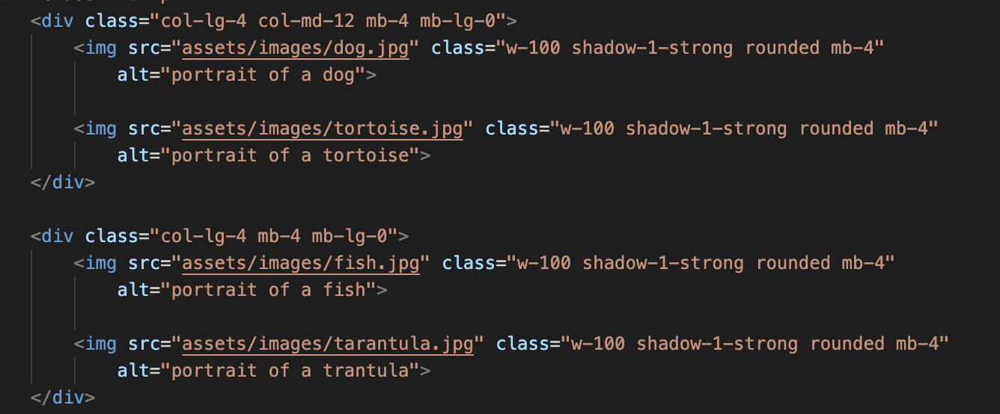

README

The Pawtrait Purrfectionist website is designed to market our artist, whose focus is portraits of pets. We intend users to use the site as a stepping stone to commissioning our artist to paint their own pet's purrfect pawtrait.

## Features 

Landing/Home page: A full cover high quality background  of one of our artist’s finest portraits, with a brief sentence overlaid, describing the services offered by our website. Pen feature takes user to contact form with placeholder text encouraging them to take out a commission.

Gallery page: Will display our artist’s pet portrait portfolio in high quality images. This will assure the user the artist can provide high quality, uniquely stylised, portraits of their own pets. 

About the Artist page: Will give a brief bio of the artist. Pen feature takes user to contact form with placeholder text encouraging them to take out a commission.

Contact page: Will allow users to contact our artist directly using a responsive contact form, requesting phone number, email address, and a responsive message text box, which will allow the user to move easily towards commissioning their own pet portrait. The form will be unable to be submitted until all sections of the form are completed, including the email address in the correct format. There will be placeholder text that will allow the user to know our artist is available for commissions, or to answer any questions, and encouraging the user to get in touch.

Header: Links to the other pages of the website will be fixed and identical across all pages to provide consistency and ease of navigation and prevent extra clicks being required to go home and then forward again. Extra bold added to page that user is currently on to improve navigability.

 Footer: Identical across all pages which will provide links to the artist’s social media accounts and their email and phone number to provide ease of access from the first page. It will also provide provide further evidence of the artist's work, and the ability to gather reviews from others and provide further engagement.

Alternative Text: We have added alternative text to all images to ensure accessibility for visually impaired users

## UX

<strong>Site Goals</strong>

The Pawtrait Purrfectionist (aka Luna Felix) website is designed to market our artist, whose focus is portraits of pets. We intend users to use the site as a stepping stone to commissioning our artist to paint their own pet's purrfect pawtrait.

<strong>Design Choices</strong>

We selected a captivating comic book style, using bright high contrast colours, based on Luna's distinctive style of portrait painting. This means there would be stylistic continuity between the gallery of her work, as well as the portraits that provide the background images on all pages of the website.

<strong>Wire Frames</strong>

Home Page

Gallery Page

About Page

Contact Page

<strong>User Stories</strong>

As a User, I can view the Landing page

As a User, I can view the Gallery page

As a User, I can view the Contact page

As a User, I can view the About page

As a User, I would like to easily link to your social media. As a User, I can clearly see which page I am on from the Nav Bar

As a User, I want to be able to contact the site owner to enquire about commissions

As a User, I want to be able to easily make purchases from the site

As a User, I want quick access to customer reviews

As a User, I want to easily find the services you provide

[DEV] deploy site to public git hosting

[DEV] HTML template

[DEV] Tidy up styling

[DEV] Add accessibility options

[DEV] Test website

[DEV] finish README

[DEV] add metadata to html pages

[DEV] quality images

## Testing 

<table>
    <thead>
        <th>Feature</th>
        <th>Expect</th>
        <
        <th>Result</th>
    </thead>
    <tbody>
        <tr>
            <td>Navbar links</td>
            <td>1.Take you to the relevant webpage 2.Show which page you are on</td>
            <td>Success</td>
            <td></td>
        </tr>
        <tr>
            <td>Social media links</td>
            <td>Take you to that particular website when icon is clicked</td>
            <td>Success</td>
            <td></td>
        </tr>
        <tr>
            <td>Logo acts as home page link</td>
            <td>Logo when clicked takes you to home page</td>
            <td>Success</td>
            <td></td>
        </tr>
        <tr>
            <td>All pages responsive</td>
            <td>Pages respond differently depending on resolution of device to reduce feature cluttering, and display essential features.</td>
            <td>Success</td>
            <td></td>
        </tr>
        <tr>
            <td>Pen icon on home and about page takes you to get in touch form</td>
            <td>Pen icon on page takes user to get in touch form</td>
            <td>Success</td>
            <td></td>
        </tr>
                <tr>
            <td>About page exhibits image of and bio of artist</td>
            <td>About page exhibits image of and bio of artist</td>
            <td>Success</td>
            <td></td>
        </tr>
        <tr>
            <td>Gallery page exhibits art</td>
            <td>All images visible in equal proportion</td>
            <td>Success</td>
            <td></td>
        </tr>
        <tr>
            <td>Contact form</td>
            <td>1. Sends message 2.Gives feedback send is successful in seperate window</td>
            <td>Success</td>
            <td></td>
        </tr>
        <tr>
            <td>Gallery images have alt text for screenreader</td>
            <td>When image is removed a short text message is displayed</td>
            <td>Success</td>
            <td></td>
        </tr>
                <tr>
            <td>Contact form requires correct formatting</td>
            <td>Contact form must be completed in correct format for message to be sent</td>
            <td>Success</td>
            <td></td>
        </tr>
        <tr>

        
 
   
        

        

</table>

## Features Left to Implement

We considered adding a price structure but assigned it a "wont have" on our kanban board, as it would be difficult to implement in the time available given the need for payment processing options etc, and potentially seen as gauche and detract from the value of the artist's work, having reviewed other artist's websites e.g.https://www.rayhart.com/rayhart

Considered a reviews section but defined it as a "won't have" given the time available. We felt that also it may appear somewhat gauche on an artistic website, and there were links to social media should provide access to reviews if desired by the user.

Phone number and email address not interactive which would be nice but ran out of time

Hover feature on social media links

### Validator Testing 

For HTML validation https://validator.w3.org/

For CSS validation  https://jigsaw.w3.org/css-validator/

  

### Unfixed Bugs

- Shadow around the hamburger icon spills over edge of element

## Deployment

Site successfully deployed on https://tomcow88.github.io/teamBrizzle/

## Credits 

We perused various sites on https://colorlib.com/wp/artist-portfolio-websites/

We finally settled on https://www.rayhart.com/rayhart as the primary source of inspiration

We referred to Love Rosie;
https://github.com/Code-Institute-Solutions/resume-miniproject-bootstrap4/

and Love Running CI walkthrough projects.
https://github.com/Code-Institute-Solutions/love-running-v3/

### Content 

Skeleton form code taken from https://www.reusableforms.com/f/contact-form-in-bootstrap/obnfe8uh/

Help with form opacity and to provide a target for the completed form taken from Love Running https://8000-peterbrown4-loverunning-xmpdh8b7eut.ws-eu107.gitpod.io/signup.html

For help with hyperlinking email and phone numbers https://www.tutorialspoint.com/html/html_email_links.htm

Social Media links taken from fontawesome https://fontawesome.com/icons/categories/social

For validation in HTML https://validator.w3.org/

For validation in CSS https://jigsaw.w3.org/css-validator/

For ReadME table https://www.shecodes.io/athena/2362-creating-a-table-with-4-columns-and-4-rows-in-html

Wireframes produced using Balsamiq WireFrames https://balsamiq.com/wireframes/?gad_source=1&gclid=CjwKCAiA44OtBhAOEiwAj4gpOexFh0z3peWS6wolbjlJt_fLq7cZGNu99YeMSIpU89wlL2p6ZluXiRoCOSUQAvD_BwE

We also used Chat GPT to generate the text on the website.
https://chat.openai.com/

### Media

Art and images produced by https://www.bing.com/images/create/

## Other General Project Advice

Credit to the other team leads and to Iris for steering the ship!