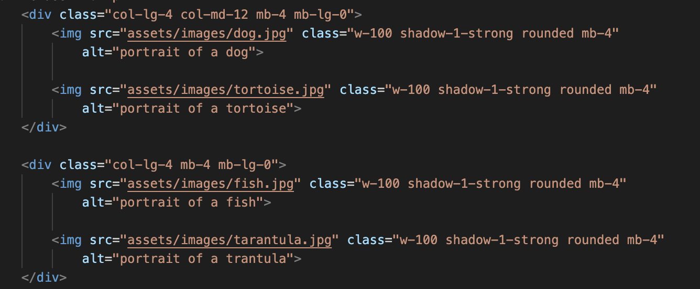

Peter Brown's README

The Pawtrait Purrfectionist website is designed to market our artist, whose focus is portraits of pets. We intend users to use the site as a stepping stone to commissioning our artist to paint their own pet's purrfect pawtrait, [or use their work in an exhibition.?]

## Features 

Landing page: A full cover high quality background  of one of our artist’s finest portraits, with a brief sentence overlaid, describing the services offered by our website.

Gallery page: Will display our artist’s pet portrait portfolio in high quality images. This will assure the user the artist can provide high quality, uniquely stylised, portraits of their own pets. [Or alternatively that their work would be suitable for an exhibition?] 

About the Artist page: Will elaborate on the philosophy and background of our artist, and explain how they began on their journey to become the Pawtrait Purrfectionist.

Contact page: Will allow users to contact our artist directly using a responsive contact form, requesting phone number, email address, and a responsive message text box, which will allow the user to move easily towards commissioning their own pet portrait. The form will be unable to be submitted until all sections of the form are completed, including the email address in the correct format. There will be placeholder text that will allow the user to know our artist is available for commissions, or to answer any questions, and encouraging the user to get in touch.

Header: Links to the other pages of the website will be fixed and identical across all pages to provide consistency and ease of navigation and prevent extra clicks being required to go home and then forward again.

 Footer: Fixed across all pages which will provide links to the artist’s social media accounts and their email and phone number to provide ease of access from the first page. It will also provide d provide further evidence of the artist's work, and the ability to gather reviews from others and provide further engagement.

Alternative Text: We have added alternative text to all images to ensure accessibility for visually impaired users

## UX

<strong>Site Goals</strong>

The Pawtrait Purrfectionist (aka Luna Felix) website is designed to market our artist, whose focus is portraits of pets. We intend users to use the site as a stepping stone to commissioning our artist to paint their own pet's purrfect pawtrait.

<strong>Design Choices</strong>

We selected a captivating comic book style, using bright high contrast colours, based on Luna's distinctive style of portrait painting. This means there would be stylistic continuity between the gallery of her work, as well as the portraits that provide the background images on all pages of the website.

<strong>Wire Frames</strong>

<strong>User Stories</strong>

1. As a Developer, I can deploy my site to a cloud hosted software

2. As a site User, I can view the Gallery page

3. As a site User, I can view the landing page

4. As a site user, I want to be able to easily make purchases from the site.

5. As a user of the website, I would like to clearly see which page I'm on.

6. As a site user, I want to easily find the services you provide.

7. As a site user, I want access to customer reviews.

8.  As a user of this website, I would like to easily link to your social media.

9. As a Developer, I have created a template HTML that I will use to create other pages from that includes header, nav, footer and anything else I want 

10. As a site User, I can view the Contact Me page and contact the owner

11. As a User, I can view the About Me page

## Testing Section

## Features Left to Implement

We considered adding a price structure but assigned it a "wont have" on our kanban board, as it would be difficult to implement in the time available given the need for payment processing options etc, and potentially seen as gauche and detract from the value of the artist's work, having reviewed other artist's websites e.g.https://www.rayhart.com/rayhart

Considered a reviews section but defined it as a "won't have" given the time available. We felt that also it may appear somewhat gauche on an artistic website, and there were links to social media should provide access to reviews if desired by the user.

Contact page/Form: Feedback once form has been submitted would be nice however there isn't the backend to receive the form currently in place.

## Testing 

<table>
    <thead>
        <th>Feature</th>
        <th>Expect</th>
        <th>Action</th>
        <th>Result</th>
    </thead>
    <tbody>
        <tr>
            <td>Navbar links</td>
            <td>1.Take you to the relevant webpage 2.Show which page you are on</td>
            <td></td>
            <td></td>
        </tr>
        <tr>
            <td>Social media links</td>
            <td>Take you to that particular website when icon is clicked</td>
            <td></td>
            <td></td>
        </tr>
        <tr>
            <td>Logo acts as home page link</td>
            <td>Logo when clicked takes you to home page</td>
            <td></td>
            <td></td>
        </tr>
        <tr>
            <td>All pages responsive</td>
            <td>Pages respond differently depending on resolution of device to reduce feature cluttering, and display essential features.</td>
            <td></td>
            <td></td>
        </tr>
        <tr>
            <td>Pen icon on about page takes you to get in touch form</td>
            <td>Pen icon on page takes user to get in touch form</td>
            <td></td>
            <td></td>
        </tr>
                <tr>
            <td>About page exhibits image of and small bio of artist</td>
            <td>About page exhibits image of and small bio of artist</td>
            <td></td>
            <td></td>
        </tr>
        <tr>
            <td>Gallery page exhibits art</td>
            <td>All images visible in equal proportion</td>
            <td></td>
            <td></td>
        </tr>
        <tr>
            <td>Contact form</td>
            <td>1. Sends message 2.Gives feedback send is successful in seperate window</td>
            <td></td>
            <td></td>
        </tr>
        <tr>
            <td>Alternative descriptive text on images</td>
            <td>When image is removed a short text message is displayed</td>
            <td></td>
            <td></td>
        </tr>
                <tr>
            <td>Row 1 Column 1</td>
            <td></td>
            <td></td>
            <td></td>
        </tr>
        <tr>
            <td>Row 2 Column 1</td>
            <td></td>
            <td></td>
            <td></td>
        </tr>
        <tr>
            <td>Row 3 Column 1</td>
            <td></td>
            <td></td>
            <td></td>
        </tr>
        <tr>
            <td>Row 4 Column 1</td>
            <td></td>
            <td></td>
            <td></td>
        </tr>
                <tr>
            <td>Row 1 Column 1</td>
            <td></td>
            <td></td>
            <td></td>
        </tr>
        <tr>
            <td>Row 2 Column 1</td>
            <td></td>
            <td></td>
            <td></td>
        </tr>
        

        
   
</table>

### Validator Testing 

HTML
  

CSS
  

### Unfixed Bugs

## Deployment

## Credits 

### Content 

We perused various sites on https://colorlib.com/wp/artist-portfolio-websites/

We finally settled on https://www.rayhart.com/rayhart as the primary source of inspiration

Form taken from https://www.reusableforms.com/f/contact-form-in-bootstrap/obnfe8uh/

For help with hyperlinking email and phone numbers https://www.tutorialspoint.com/html/html_email_links.htm

For validation in HTML https://validator.w3.org/

For validation in CSS https://jigsaw.w3.org/css-validator/

For ReadME table https://www.shecodes.io/athena/2362-creating-a-table-with-4-columns-and-4-rows-in-html

### Media

Art produced by https://www.bing.com/images/create/dog-playing-in-ocean-spray/1-659f0f3e93c24653a979edc04ea7f3e5?FORM=GENCRE

## Other General Project Advice